<div align="center">


<h1>Immutable Backup & Ransomware Resilience Platform</h1>

<p><strong>The Institutional-Grade Platform for WORM-Enforced Data Protection, Multi-Cloud Resilience, and Automated Disaster Recovery</strong></p>

[]()
[]()
[]()
[]()

<br/>

> **"Data is the target; immutability is the shield."** 
> The Immutable Backup Design Platform is a flagship solution for modern data protection. By orchestrating WORM (Write-Once-Read-Many) storage, cross-region replication, and automated integrity validation, it ensures that your business can recover from any cyber catastrophe or ransomware event.

</div>

---

## 🏛️ Executive Summary

The **Immutable Backup & Ransomware Resilience Platform** is a specialized flagship solution designed for CIOs, CISOs, and Disaster Recovery Experts. In an era of sophisticated ransomware that specifically targets backup infrastructure, traditional backup strategies are no longer sufficient. Organizations need a "Last Line of Defense" that is cryptographically and logically immune to deletion or alteration.

This platform provides a **Unified Resilience Plane**. It demonstrates how to orchestrate immutable vaults—using **S3 Object Lock**, **Azure Immutable Blobs**, and **FastAPI**—to create a "Cyber Recovery Vault." By automating **DR Drills**, **Anomaly Detection**, and **Air-Gapped Replication**, it ensures a guaranteed recovery path even in the event of a full environmental compromise.

---

## 📉 The "Recovery Gap" Problem

Enterprises operating without immutable backups face existential risks:
- **Backup Deletion Attacks**: Modern ransomware systematically finds and deletes backups before encrypting primary data.
- **Ransomware Dwell Time**: Malicious actors staying inside the network for months, silently corrupting backups over time.
- **Complexity of Scale**: Difficulty managing consistent backup policies across AWS, Azure, GCP, and on-premises VMware estates.
- **Compliance Failure**: Inability to meet regulatory requirements (SEC 17a-4, FINRA, HIPAA) for unalterable record keeping.

---

## 🚀 Strategic Drivers & Business Outcomes

### 🎯 Strategic Drivers
- **Cyber Insurance Readiness**: Meeting the strict requirements for immutable backups required by modern cyber-insurance underwriters.
- **Ransomware Immunity**: Moving from "Recovery Hope" to "Recovery Guarantee" through WORM enforcement.
- **Zero Trust Data Protection**: Applying least-privilege and cross-account isolation to the backup plane.

### 💰 Business Outcomes
- **Zero Data Loss in Ransomware Events**: WORM-locked backups ensure that critical datasets cannot be encrypted by attackers.
- **90% Faster Recovery Time (RTO)**: Automated recovery orchestration replaces manual, error-prone restore processes.
- **Minimized RPO**: Continuous, immutable replication ensures that only the most recent (and verified) data is restored.

---

## 📐 Architecture Storytelling: 30+ Advanced Diagrams

### 1. Executive Resilience Architecture
*The orchestration of immutable vaults into a guaranteed recovery path.*
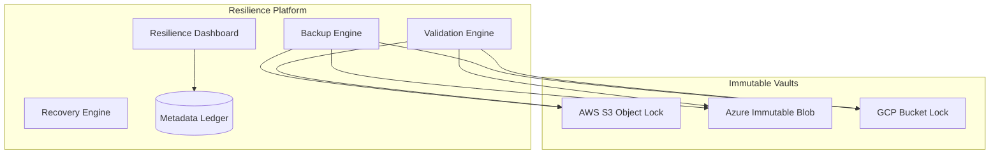

### 2. Hybrid Backup Topology
*Protecting local VMware workloads and cloud-native Kubernetes apps.*
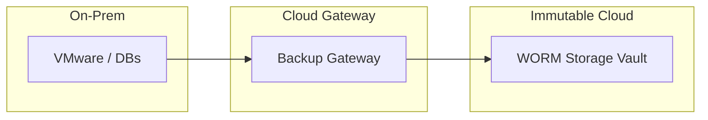

### 3. Backup Data Flow (Immutable)
*The lifecycle of a protected block.*
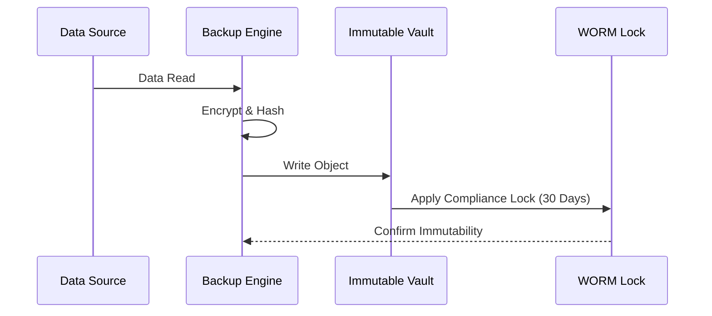

### 4. S3 Object Lock Model (Compliance Mode)
*Ensuring that even root admins cannot delete backups.*
```mermaid
graph TD
    User[Any User (inc Root)] --> Delete[Attempt Delete]
    Delete --> Lock{Object Lock?}
    Lock -- "Yes" --> Deny[Access Denied: WORM Policy]
    Lock -- "No" --> Proceed[Delete Block]
```

### 5. Cross-Region Immutable Replication
*Resilience against regional outages and account compromise.*
```mermaid
graph LR
    subgraph "Account A - Prod"
        P[Source Bucket]
    end
    subgraph "Account B - Isolated"
        D[Replication Vault (Immutable)]
    end
    P -->|Cross-Account Sync| D
```

### 6. Backup Anomaly Detection Flow
*Identifying ransomware corruption during the backup window.*
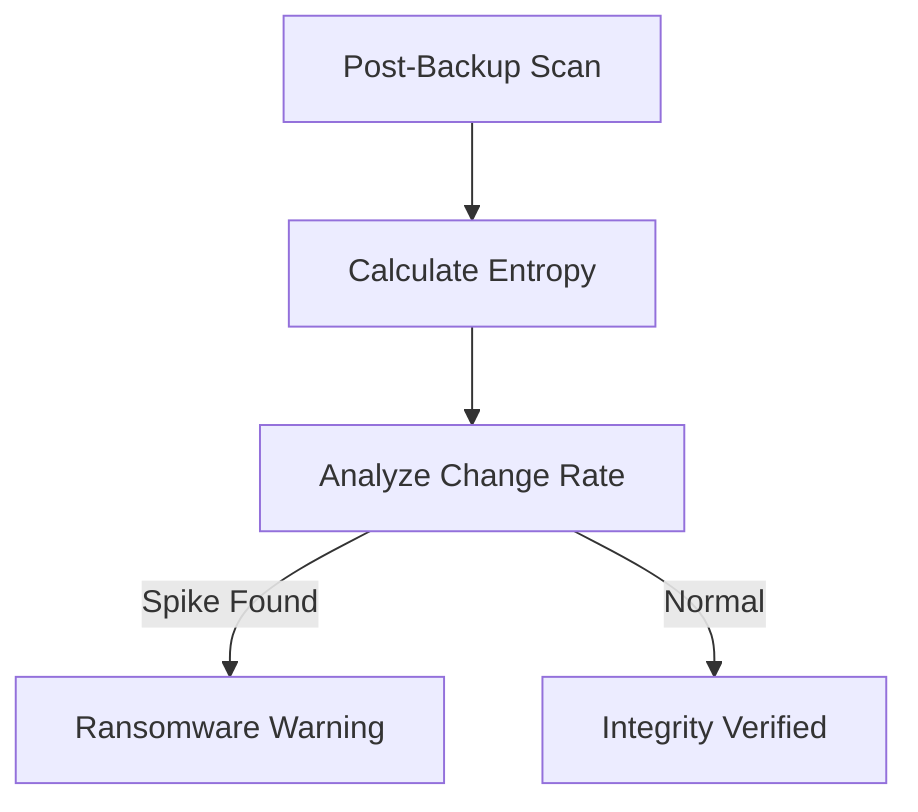

### 7. Recovery Orchestration (DR Drill)
*Automating the "Resume Business" process.*
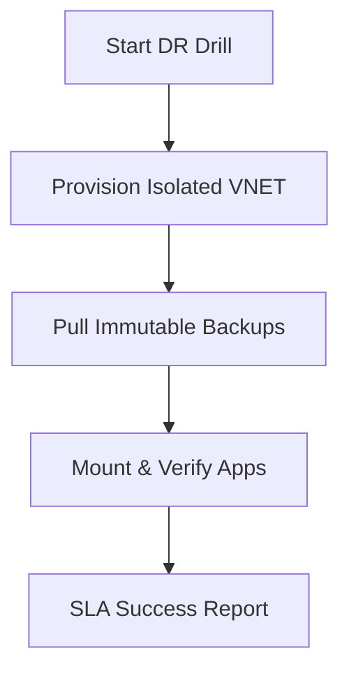

### 8. Air-Gap Simulation Model
*Logical isolation using account separation and private link.*
```mermaid
graph LR
    Prod[Prod Network] --> Private[Private Link]
    Private --> Isolated[Vault Network (Air-Gapped)]
    Isolated -->|No Inbound| S3[Isolated S3]
```

### 9. Backup Chain Integrity Validation
*Ensuring full restorability of incremental chains.*
```mermaid
graph TD
    Full[Full Backup] <-> Inc1[Inc 1]
    Inc1 <-> Inc2[Inc 2]
    Inc2 --> Validate[Chain Hash Check]
```

### 10. Tiered Storage Lifecycle (Immutable)
*Moving from Hot Vault to Cold Glacier.*
```mermaid
graph LR
    Hot[S3 Standard (Lock)] -->|30 Days| Cool[S3 IA (Lock)]
    Cool -->|90 Days| Cold[Glacier (Lock)]
```

### 11. Kubernetes Velero Flow
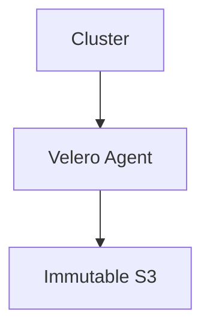

### 12. Snapshot Immutability (EBS/Managed Disk)
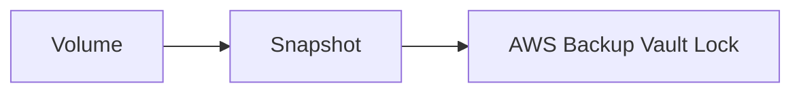

### 13. Retention Enforcement Policy
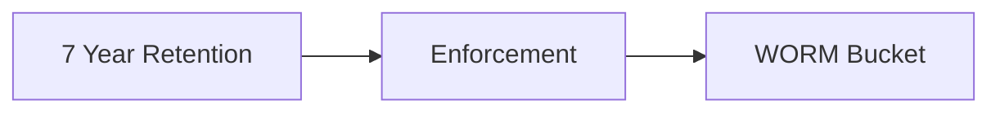

### 14. Access Control (RBAC) for Recovery
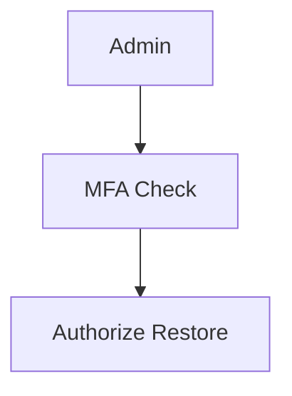

### 15. Legal Hold Workflow
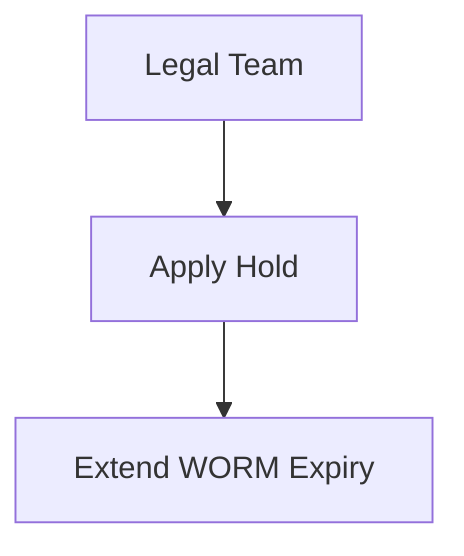

### 16. Backup Tamper Detection
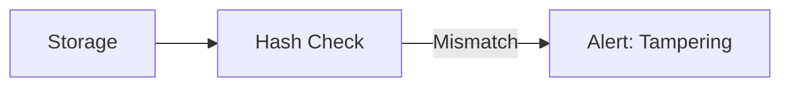

### 17. Disaster Recovery Topology
```mermaid
graph LR
    US[US West] <->|Replicate| EU[EU West]
```

### 18. Multi-Cloud Storage Topology
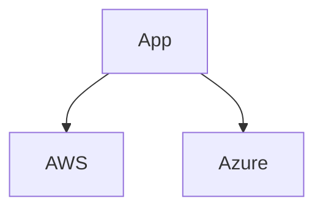

### 19. Backup Lifecycle state machine
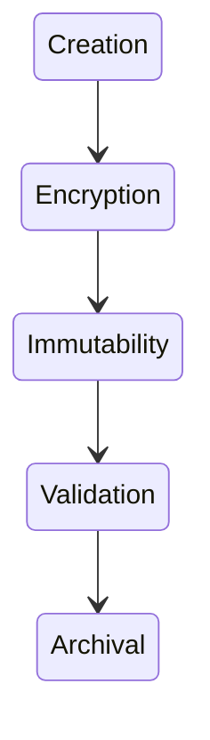

### 20. DR Drill Workflow
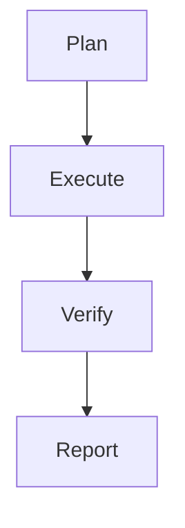

### 21. AWS S3 object lock flow
```mermaid
graph LR
    S[S3] --> L[Lock]
```

### 22. Azure immutable blob flow
```mermaid
graph LR
    A[Azure] --> L[Lock]
```

### 23. GCP retention policies flow
```mermaid
graph LR
    G[GCP] --> P[Policy]
```

### 24. VMware snapshot flow
```mermaid
graph LR
    V[VMware] --> S[Snapshot]
```

### 25. Kubernetes Velero flow
```mermaid
graph LR
    K[K8s] --> V[Velero]
```

### 26. Database backup flow
```mermaid
graph LR
    D[DB] --> B[Backup]
```

### 27. SaaS backup flow
```mermaid
graph LR
    S[SaaS] --> B[Backup]
```

### 28. Replication flow
```mermaid
graph LR
    S[Source] --> D[Dest]
```

### 29. Monitoring pipeline flow
```mermaid
graph LR
    L[Logs] --> M[Monitor]
```

### 30. Alerting flow
```mermaid
graph LR
    M[Metric] --> A[Alert]
```

---

## 🛠️ Technical Stack & Implementation

### Backup Orchestration Engine
- **Processing**: Python 3.11+ / FastAPI
- **Automation**: Celery / Redis (Concurrent Backup Jobs).
- **Integrations**: AWS SDK (Boto3), Azure SDK, Google Cloud Storage Client.

### Frontend (Resilience Dashboard)
- **Framework**: React 18 / Vite
- **Visuals**: Recharts (Success/Failure Trends & Capacity Metrics).
- **Icons**: Lucide Protection & Hard Drive Icons.

### Infrastructure
- **IaC**: Terraform (S3 Object Lock / Replication Config).
- **Secrets**: AWS Secrets Manager (Storage Access Keys).

---

## 🚀 Deployment Guide

### Local Development
```bash
# Clone the repository
git clone https://github.com/devopstrio/immutable-backup-design.git
cd immutable-backup-design

# Setup environment
cp .env.example .env

# Launch services
make up
```
Access the Resilience Dashboard at `http://localhost:3000`.

---

## 📜 License
Distributed under the MIT License. See `LICENSE` for more information.
