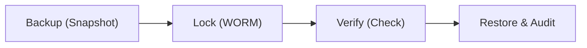
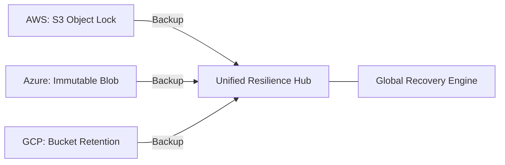
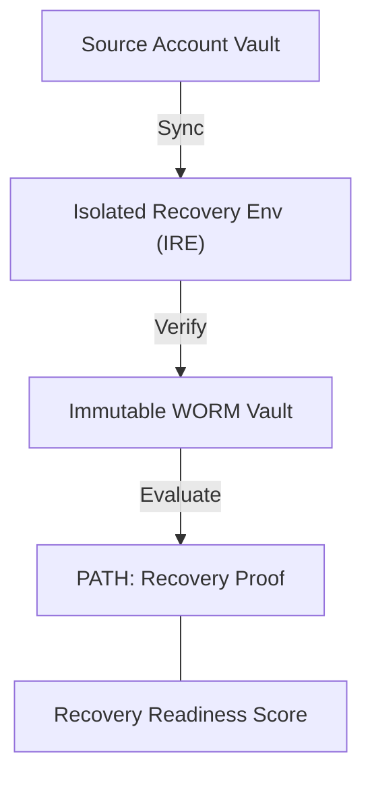
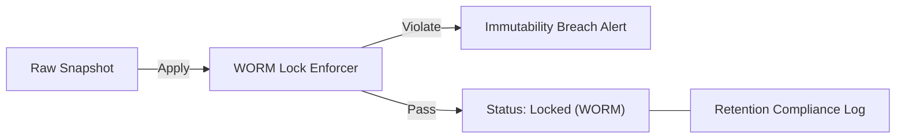
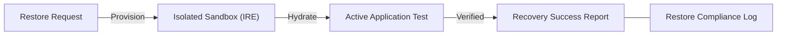
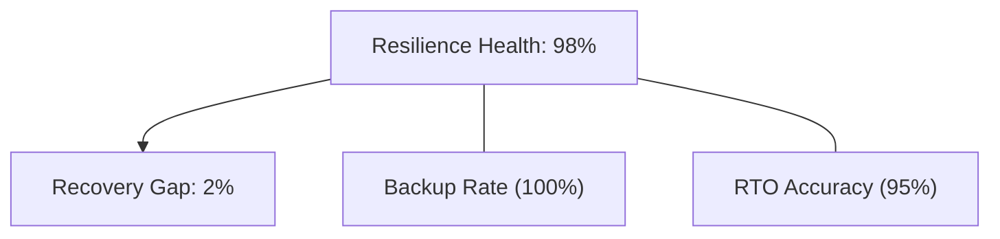
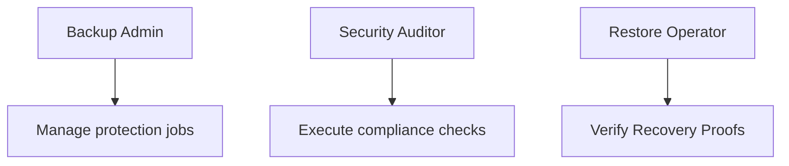
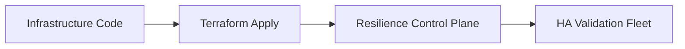
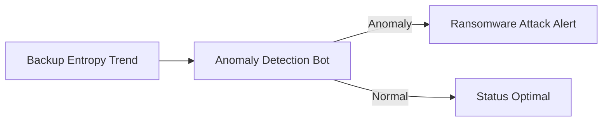
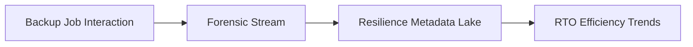

<div align="center">


<h1>Immutable Backup Design</h1>

<p><strong>The Institutional-Grade Platform for WORM-Enforced Data Protection, Multi-Cloud Resilience, and Automated Disaster Recovery.</strong></p>

[]()
[]()
[]()

<br/>

> **"Data is the target; immutability is the shield."** 
> **Immutable Backup Design** is an enterprise-grade platform designed to provide a secure, measurable, and highly automated foundation for global resilience operations. It orchestrates the complex lifecycle of data protection—from WORM-locked snapshots and air-gapped replication to AIOps-driven anomaly detection and unified recovery governance.

</div>

---

## 🏛️ Executive Summary

Fragmented backup strategies and manual recovery processes are strategic operational liabilities; lack of centralized immutable orchestration is a primary barrier to organizational ransomware resilience. Organizations fail to achieve guaranteed recovery not because of a lack of storage, but because of fragmented backup standards, lack of automated lock validation, and an inability to orchestrate immutable landing zones with operational precision.

This platform provides the **Resilience Intelligence Plane**. It implements a complete **Enterprise Immutable-as-Code Framework**, enabling Backup and Security teams to manage global data protection as first-class citizens. By automating the identification of ransomware patterns through real-time backup analysis and orchestrating the vaulting of air-gapped replicas, we ensure that every organizational asset—from critical database clusters to routine application snapshots—is locked by default, audited for history, and strictly aligned with institutional resilience frameworks.

---

## 📐 Architecture Storytelling: Principal Reference Models

### 1. Principal Architecture: Global Immutable Backup & Resilience Intelligence Plane
This diagram illustrates the end-to-end flow from multi-cloud backup ingestion and WORM locking to air-gapped replication, isolated recovery, and institutional resilience auditing.


```mermaid
graph LR
    %% Subgraph Definitions
    subgraph BackupIngress["Multi-Cloud & Workload Ingress"]
        direction TB
        EBS_Disk_Snaps["EBS / Managed Disk Snapshots"]
        DB_Clusters["RDS / SQL DB Backups"]
        K8s_Persistent["Velero / K8s PV Backups"]
    end

    subgraph IntelligenceEngine["Resilience Intelligence Hub"]
        direction TB
        API["FastAPI Resilience Gateway"]
        LockEngine["WORM Enforcement Hub"]
        ReplicationOrch["Air-Gap Replication Orch"]
        RecoveryOrch["Isolated Recovery Runner"]
    end

    subgraph OperationsPlane["Distributed Backup Fleet"]
        direction TB
        ImmutabilityNodes["Compliance-Mode Lockers"]
        IntegrityDetectors["AIOps Entropy Scanners"]
        VaultSync["Cross-Account Vault Sync"]
    end

    subgraph OperationsHub["Institutional Resilience Hub"]
        direction TB
        Scorecard["Resilience Maturity Score"]
        Analytics["RTO & RPO Adherence Stats"]
        Audit["Forensic Backup Metadata Lake"]
    end

    subgraph DevOps["Immutable-as-Code Framework"]
        direction TB
        TF["Terraform Backup Modules"]
        RansomwareBot["Backup Anomaly Validator"]
        ChatOps["Restore Approval Hub"]
    end

    %% Flow Arrows
    BackupIngress -->|1. Submit Backup| API
    API -->|2. Enforce Lock| LockEngine
    LockEngine -->|3. Sync Air-Gap| ReplicationOrch
    ReplicationOrch -->|4. Manage Recovery| RecoveryOrch
    
    RecoveryOrch -->|5. Execute Validation| OperationsPlane
    OperationsPlane -->|6. Notify Status| ChatOps
    API -->|7. Visualize Health| Scorecard
    
    Scorecard -->|8. Track Success| Analytics
    Scorecard -->|9. Record Lock| Audit
    
    TF -->|10. Provision Hub| IntelligenceEngine
    RansomwareBot -->|11. Inject Entropy Risk| LockEngine
    Audit -->|12. Improve Lock| ImmutabilityNodes

    %% Styling
    classDef ingress fill:#f5f5f5,stroke:#616161,stroke-width:2px;
    classDef intel fill:#e8eaf6,stroke:#1a237e,stroke-width:2px;
    classDef operations fill:#e1f5fe,stroke:#01579b,stroke-width:2px;
    classDef ops fill:#ede7f6,stroke:#311b92,stroke-width:2px;
    classDef devops fill:#e8f5e9,stroke:#1b5e20,stroke-width:2px;

    class BackupIngress ingress;
    class IntelligenceEngine intel;
    class OperationsPlane operations;
    class OperationsHub ops;
    class DevOps devops;
```

### 2. The Immutable Backup Lifecycle Flow
The continuous path of a protected asset from initial backup (snapshot) and WORM locking to active verification, air-gapped replication, restoration, and institutional forensic auditing.


```mermaid
graph LR
    Backup["Backup (Snapshot)"] --> Lock["Lock (WORM)"]
    Lock --> Verify["Verify (Check)"]
    Verify --> Restore["Restore & Audit"]
```

### 3. Distributed Multi-Cloud Immutable Storage Topology
Strategically orchestrating immutable backups across AWS, Azure, GCP, and on-premises environments, providing a unified institutional view of global data protection and recovery readiness.


```mermaid
graph LR
    AWS["AWS: S3 Object Lock"] -->|Backup| Hub["Unified Resilience Hub"]
    Azure["Azure: Immutable Blob"] -->|Backup| Hub
    GCP["GCP: Bucket Retention"] -->|Backup| Hub
    Hub --- Logic["Global Recovery Engine"]
```

### 4. Air-Gapped Replication & Vaulting Flow
Executing complex logic for securely moving locked data to an isolated recovery environment (IRE) in a separate account or region, ensuring institutional protection against source-environment compromise.


```mermaid
graph TD
    Source["Source Account Vault"] -->|Sync| AirGap["Isolated Recovery Env (IRE)"]
    AirGap -->|Verify| Lock["Immutable WORM Vault"]
    Lock -->|Evaluate| Action["PATH: Recovery Proof"]
    Action --- Estimate["Recovery Readiness Score"]
```

### 5. Object Lock & Retention Policy Governance Flow
Automatically enforcing legal holds and compliance-mode locking—including retention durations—directly via policy-as-code, ensuring organizational audit readiness by default.


```mermaid
graph LR
    Snapshot["Raw Snapshot"] -->|Apply| Guard["WORM Lock Enforcer"]
    Guard -->|Violate| Alert["Immutability Breach Alert"]
    Guard -->|Pass| Verify["Status: Locked (WORM)"]
    Verify --- Audit["Retention Compliance Log"]
```

### 6. Isolated Recovery Environment (IRE) Restore Flow
Managing the lifecycle of a restoration test, automatically verifying backup integrity in a secured sandbox before approving production restoration, ensuring zero-latency recovery confidence.


```mermaid
graph LR
    Request["Restore Request"] -->|Provision| Sandbox["Isolated Sandbox (IRE)"]
    Sandbox -->|Hydrate| App["Active Application Test"]
    App -->|Verified| Report["Recovery Success Report"]
    Report --- Audit["Restore Compliance Log"]
```

### 7. Institutional Resilience Maturity Scorecard
Grading organizational performance based on key indicators: Backup Success Rate, RTO (Restore Time) Adherence, and RPO (Point) Adherence Index.


```mermaid
graph TD
    Post["Resilience Health: 98%"] --> Risk["Recovery Gap: 2%"]
    Post --- C1["Backup Rate (100%)"]
    Post --- C2["RTO Accuracy (95%)"]
```

### 8. Identity & RBAC for Backup Governance
Managing fine-grained access to backup schedules, restore triggers, and audit logs between Backup Admins, Security Auditors, and Restore Operators.


```mermaid
graph TD
    Admin["Backup Admin"] --> Hub["Manage protection jobs"]
    Auditor["Security Auditor"] --> Exec["Execute compliance checks"]
    Operator["Restore Operator"] --> Audit["Verify Recovery Proofs"]
```

### 9. IaC Deployment: Immutable-as-Code Framework
Using modular Terraform to deploy and manage the versioned distribution of the resilience tracking hubs, immutability workers, and forensic metadata lakes.


```mermaid
graph LR
    HCL["Infrastructure Code"] --> TF["Terraform Apply"]
    TF --> Engine["Resilience Control Plane"]
    Engine --> Clusters["HA Validation Fleet"]
```

### 10. AIOps Backup Anomaly & Ransomware Validation Flow
Using advanced analytics to identify sudden surges in changed data, suspicious delete attempts, or unusual entropy velocities that could result in institutional data loss.


```mermaid
graph LR
    Entropy["Backup Entropy Trend"] --> Analyzer["Anomaly Detection Bot"]
    Analyzer -->|Anomaly| Alert["Ransomware Attack Alert"]
    Analyzer -->|Normal| Pass["Status Optimal"]
```

### 11. Metadata Lake for Forensic Backup Audit
Storing long-term records of every backup job, every lock event recorded, and every restore verification for institutional record-keeping, compliance auditing, and post-event forensics.


```mermaid
graph LR
    Job["Backup Job Interaction"] --> Stream["Forensic Stream"]
    Stream --> Lake["Resilience Metadata Lake"]
    Lake --> Trends["RTO Efficiency Trends"]
```

---

## 🏛️ Core Resilience Pillars

1.  **Unified Resilience Coordination**: Maximizing recovery speed by centralizing all data protection through a single institutional plane.
2.  **Automated WORM Enforcement**: Eliminating "mutable backup" scenarios through proactive and immutable object locking.
3.  **Sequential Replication Intelligence**: Ensuring zero-interruption vaulting through dependency-aware air-gapped synchronization.
4.  **Zero-Trust Account Protection**: Automatically enforcing cross-account isolation and identity-based access across all backup vaults.
5.  **Autonomous Recovery Logic**: Guaranteeing availability through automated industry-specific restoration runbooks.
6.  **Full Resilience Auditability**: Immutable recording of every lock event and restore verification for institutional forensics.

---

## 🛠️ Technical Stack & Implementation

### Resilience Engine & APIs
*   **Framework**: Python 3.11+ / FastAPI.
*   **WORM Engine**: Integration with S3 Object Lock, Azure Immutable Blobs, and GCS Bucket Retention.
*   **Replication Core**: Custom Python-based logic for cross-region and cross-account vault synchronization.
*   **Persistence**: PostgreSQL (Resilience Ledger) and Redis (Live Job State).
*   **Auth Orchestrator**: Federated OIDC/SAML for least-privilege resilience management access.

### Governance Dashboard (UI)
*   **Framework**: React 18 / Vite.
*   **Theme**: Dark, Navy, Rose (Modern high-fidelity resilience aesthetic).
*   **Visualization**: D3.js for vault topologies and Recharts for RTO velocity analytics.

### Infrastructure & DevOps
*   **Runtime**: AWS EKS or Azure Kubernetes Service (AKS) for management plane.
*   **Isolated Vault**: Air-gapped storage clusters with cryptographically enforced WORM policies.
*   **IaC**: Modular Terraform for deploying the resilience landing zone and validation fleet.

---

## 🏗️ IaC Mapping (Module Structure)

| Module | Purpose | Real Services |
| :--- | :--- | :--- |
| **`infrastructure/res_hub`** | Central management plane | EKS, PostgreSQL, Redis |
| **`infrastructure/vaults`** | Immutable storage sinks | S3, Object Lock, IAM |
| **`infrastructure/replicators`** | Air-gap sync workers | Lambda, Step Functions |
| **`infrastructure/auditing`** | Forensic resilience sinks | S3, Athena, Quicksight |

---

## 🚀 Deployment Guide

### Local Principal Environment
```bash
# Clone the resilience platform
git clone https://github.com/devopstrio/immutable-backup-design.git
cd immutable-backup-design

# Configure environment
cp .env.example .env

# Launch the Resilience stack
make init

# Trigger a mock backup ingestion and automated WORM-locking simulation
make simulate-resilience
```

Access the Resilience Dashboard at `http://localhost:3000`.

---

## 📜 License
Distributed under the MIT License. See `LICENSE` for more information.

---
<div align="center">
  <p>© 2026 Devopstrio. All rights reserved.</p>
</div>
