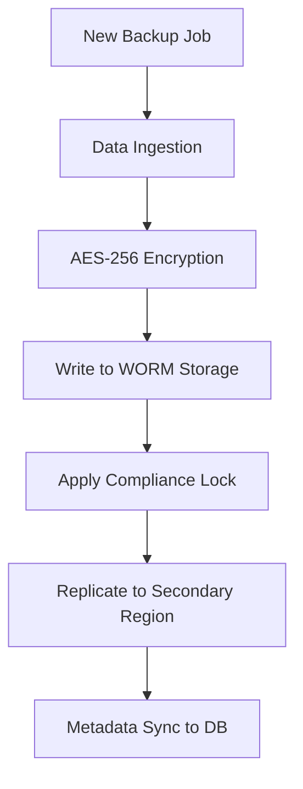
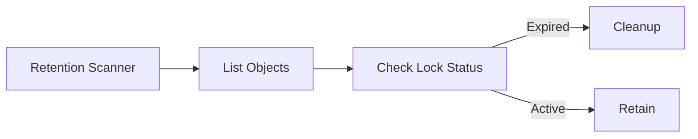
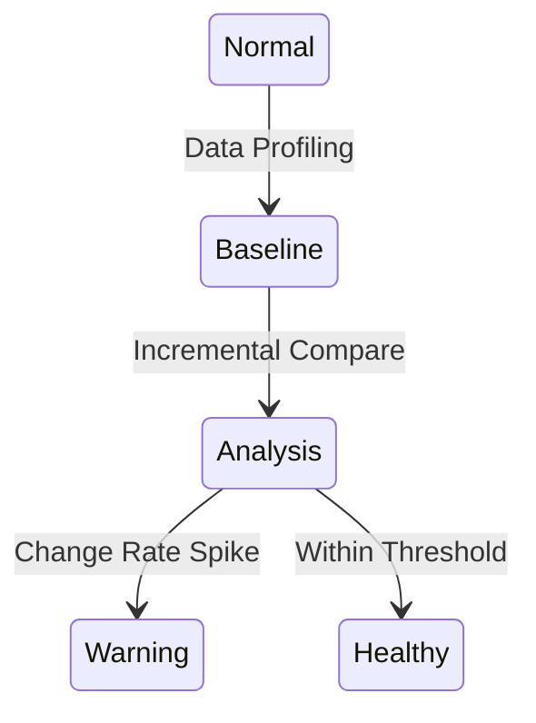

# Architecture & Data Flow Diagrams

## 11. Backup Lifecycle Management (Detailed)
*How the engine manages a backup from ingest to long-term immutable archival.*

## 13. Retention Policy Enforcement Loop

## 20. Backup Anomaly Detection Model

