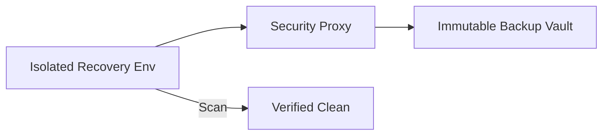
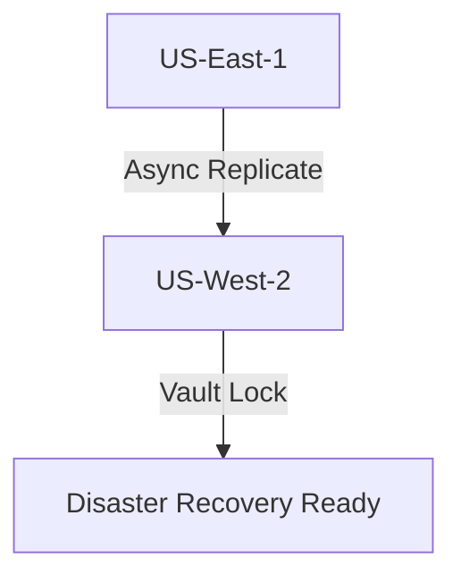
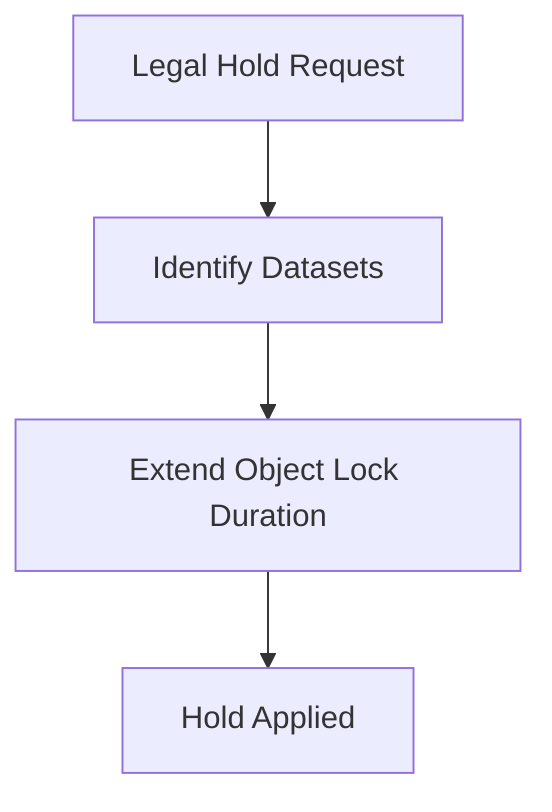

# Security & DR Diagrams

## 31. Isolated Recovery Environment (IRE)

```mermaid
graph LR
    IRE[Isolated Recovery Env] --> Proxy[Security Proxy]
    Proxy --> Vault[Immutable Backup Vault]
    IRE -->|Scan| Clean[Verified Clean]
```

## 34. Multi-Region DR Topology

```mermaid
graph TD
    Primary[US-East-1] -->|Async Replicate| Secondary[US-West-2]
    Secondary -->|Vault Lock| DR[Disaster Recovery Ready]
```

## 40. Legal Hold Enforcement Flow

```mermaid
graph TD
    Hold[Legal Hold Request] --> Identify[Identify Datasets]
    Identify --> Extend[Extend Object Lock Duration]
    Extend --> Confirm[Hold Applied]
```
